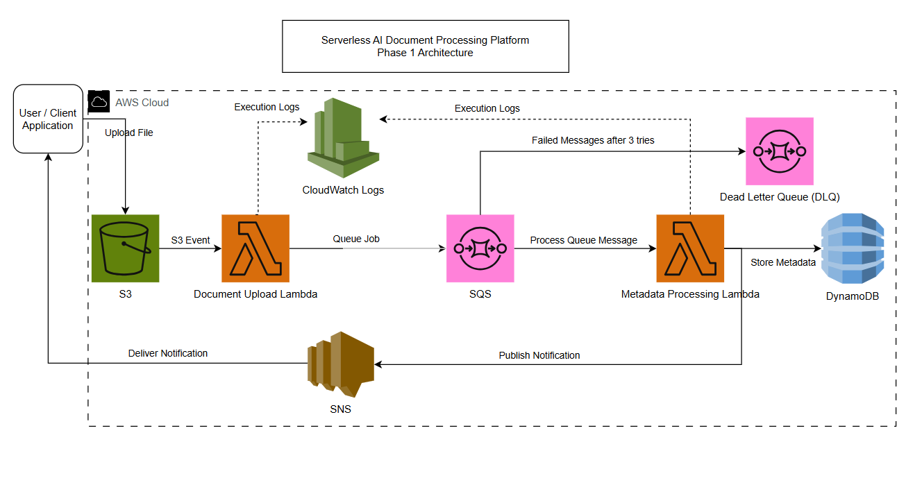
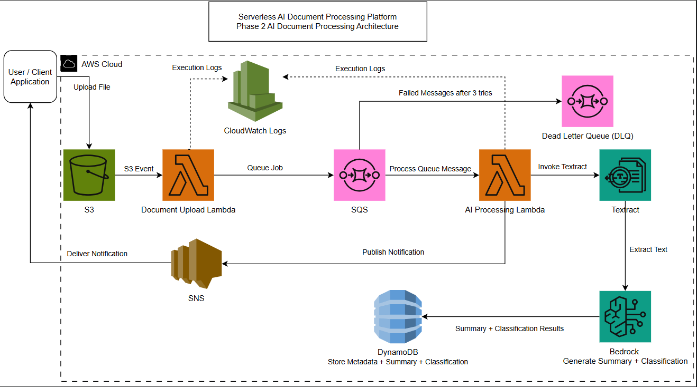
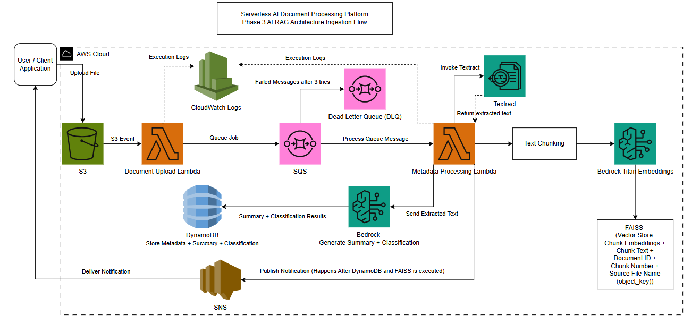
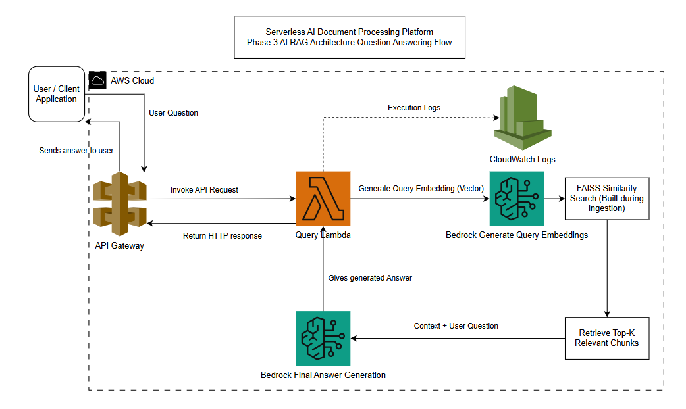

# Serverless AI Document Processing Platform with Retrieval-Augmented Generation (RAG)

## Project Overview

This project implements an end-to-end serverless AI document processing and Retrieval-Augmented Generation (RAG) system on AWS.

The platform allows users to upload documents to Amazon S3, automatically extract and process document contents using Amazon Textract and Amazon Bedrock, generate AI-powered summaries and classifications, build vector embeddings using Amazon Titan Embeddings, store embeddings in a FAISS vector index, and answer natural language questions about uploaded documents using Retrieval-Augmented Generation (RAG).

The project was developed incrementally in three phases:

* **Phase 1:** Event-Driven Serverless Document Processing
* **Phase 2:** AI-Powered Document Processing
* **Phase 3:** Retrieval-Augmented Generation (RAG)

---

# Lambda Functions

## Document Upload Lambda
Trigger: Amazon S3

Responsibilities:
- Receive S3 upload events
- Extract document metadata
- Send metadata to Amazon SQS

## Metadata Processing Lambda
Trigger: Amazon SQS

Responsibilities:
- Process document metadata
- Perform AI document processing
- Build data required for RAG workflows
- Store results and publish notifications

# Phase 1 – Event-Driven Serverless Document Processing

## Architecture

The initial implementation uses an event-driven serverless architecture where Amazon S3 triggers document ingestion, Amazon SQS decouples processing, DynamoDB stores metadata, and SNS sends notifications.

## Metadata Processing Lambda Responsibilities

* Revceive SQS messages
* Store metadata in DynamoDB
* Publish SNS notifications

## Technologies Used

* Amazon S3
* AWS Lambda
* Amazon SQS
* Amazon SQS Dead Letter Queue (DLQ)
* Amazon DynamoDB
* Amazon SNS
* Amazon CloudWatch Logs
* Python
* Boto3

## Features Implemented

* Document upload using Amazon S3
* Event-driven Lambda execution
* Decoupled processing using Amazon SQS
* Metadata storage in DynamoDB
* Email notifications using SNS
* Monitoring and debugging using CloudWatch
* Dead Letter Queue for failure handling

## Event Flow

1. User uploads a document to Amazon S3.
2. S3 triggers the Document Upload Lambda.
3. Upload Lambda extracts document metadata.
4. Metadata is sent to Amazon SQS.
5. Metadata Processing Lambda consumes the SQS message.
6. Metadata is stored in DynamoDB.
7. SNS publishes a success notification.
8. User receives an email notification.

---

# Phase 2 – AI-Powered Document Processing

## Architecture

The Metadata Processing Lambda was extended with Amazon Textract and Amazon Bedrock to perform OCR, document summarization, and document classification.

## Metadata Processing Lambda Enhancements

* Invoke Amazon Textract
* Extract document text
* Generate summaries using Claude Haiku 4.5
* Generate document classifications
* Store metadata, summaries, and classifications in DynamoDB
* Publish SNS notifications

## Technologies Used

* Amazon Textract
* Amazon Bedrock
* Claude Haiku 4.5
* Amazon DynamoDB
* Amazon SNS
* Amazon CloudWatch
* Python
* Boto3

## Features Implemented

The Metadata Processing Lambda was extended to perform:

* OCR using Amazon Textract
* AI-powered document summarization
* AI-powered document classification
* Storage of summaries and classifications in DynamoDB
* Notification publishing using SNS

## AI Workflow

1. Metadata Processing Lambda receives the SQS message.
2. Amazon Textract extracts text from uploaded documents.
3. Extracted text is sent to Amazon Bedrock.
4. Claude Haiku generates:

   * Document Summary
   * Document Classification
5. Results are stored in DynamoDB.
6. SNS publishes a success notification.

---

# Phase 3 – Retrieval-Augmented Generation (RAG)

The project was extended into a complete Retrieval-Augmented Generation (RAG) system capable of answering natural language questions about uploaded documents.

---

## Phase 3A – RAG Ingestion Pipeline

### Architecture

The ingestion pipeline extracts document text, performs chunking, generates embeddings using Amazon Titan Text Embeddings V2, and stores vectors and metadata in FAISS.

## Metadata Processing Lambda Enhancements

* Save extracted text to processed_text/
* Prepare text for chunking
* Support embedding generation workflows
* Enable FAISS index creation
* Support Retrieval-Augmented Generation (RAG) ingestion pipeline

### Technologies Used

* Amazon Textract
* Amazon Bedrock Titan Text Embeddings V2
* FAISS Vector Database
* Amazon S3
* Python
* NumPy
* FAISS
* Boto3

### Ingestion Workflow

1. User uploads a document to Amazon S3.

2. Amazon Textract extracts document text.

3. Extracted text is saved to:

   processed_text/

4. Text is divided into chunks.

5. Amazon Titan Embeddings V2 generates vector embeddings.

6. Embeddings and metadata are stored in FAISS.

Stored metadata includes:

* Document ID
* Object Key
* Chunk Number
* Chunk Text
* Source Text File

The generated files are stored in:

* faiss_index/index.faiss
* faiss_index/metadata.json

---

## Phase 3B – Question Answering Pipeline

### Architecture

The question answering pipeline generates query embeddings, performs similarity search using FAISS, retrieves the Top-K relevant chunks, augments the prompt with context, and generates answers using Claude Haiku 4.5.

### Technologies Used

* API Gateway
* AWS Lambda
* Amazon Titan Text Embeddings V2
* FAISS
* Claude Haiku 4.5
* Python
* Boto3

### Retrieval Workflow

1. User submits a question.
2. Query Lambda generates a query embedding using Amazon Titan Embeddings.
3. FAISS performs similarity search.
4. Top-K relevant chunks are retrieved.
5. Retrieved chunks are combined into context.
6. Context and user question are sent to Claude Haiku.
7. Claude generates the final answer.

---

# AWS Services Used

* Amazon S3
* AWS Lambda
* Amazon SQS
* Amazon SQS Dead Letter Queue (DLQ)
* Amazon DynamoDB
* Amazon SNS
* Amazon CloudWatch Logs
* Amazon Textract
* Amazon Bedrock
* Amazon Titan Text Embeddings V2
* Claude Haiku 4.5

---

# Skills Demonstrated

* Serverless Architecture
* Event-Driven Systems
* AWS Lambda Development
* Distributed Systems Design
* OCR using Amazon Textract
* Large Language Model (LLM) Integration
* Document Summarization
* Document Classification
* Embedding Generation
* Vector Databases (FAISS)
* Semantic Search
* Retrieval-Augmented Generation (RAG)
* Prompt Engineering
* Cloud Monitoring and Logging
* IAM and Security Best Practices
* Cost Optimization

---

# Future Enhancements

* Fully automated FAISS index generation using Lambda
* API Gateway endpoint for document question answering
* Web frontend for document upload and chat
* Multi-document RAG support
* Source citations in generated responses
* Support for DOCX and TXT documents
* Metadata filtering and hybrid search
* Conversation memory and chat history

---

# Security Considerations

For production deployments, least-privilege IAM policies should be implemented:

**Document Upload Lambda**

* Read access to S3 upload bucket
* SendMessage permission to SQS

**Metadata Processing Lambda**

* Receive/DeleteMessage permission from SQS
* Read/Write access to processed_text/
* PutItem permission to DynamoDB
* Publish permission to SNS
* Invoke permission for Amazon Bedrock
* Access permission for Amazon Textract

---

# Cost Optimization

* Pay-per-use serverless architecture
* On-demand DynamoDB capacity
* Event-driven Lambda execution
* Small test documents and messages
* CloudWatch log retention configured to 7 days
* Resources can be deleted after testing while preserving source code and documentation in GitHub
